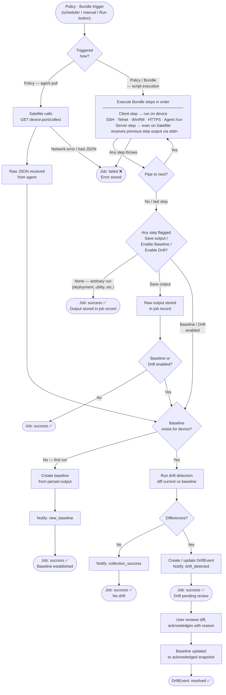

# IsotopeIQ Satellite — User Guide

## Table of Contents

1. [Overview](#overview)
2. [Getting Started](#getting-started)
3. [Navigation](#navigation)
4. [Dashboard](#dashboard)
5. [Devices](#devices)
6. [Credentials](#credentials)
7. [Scripts & Bundles](#scripts--bundles)
8. [Policies](#policies)
9. [Job Monitor](#job-monitor)
10. [Drift](#drift)
11. [Drift Exclusions](#drift-exclusions)
12. [Baselines](#baselines)
13. [Users](#users)
14. [Audit Log](#audit-log)
15. [System Settings](#system-settings)
16. [Agent Download](#agent-download)
17. [Runtime Flow Diagram](#runtime-flow-diagram)
18. [Concepts & Glossary](#concepts--glossary)
19. [WinRM Setup for Windows Devices](#winrm-setup-for-windows-devices)

---

## Overview

IsotopeIQ Satellite is a configuration collection and drift detection platform. It connects to managed devices, collects their configuration state, stores it as a structured baseline, then continuously compares live collections against that baseline to surface drift — unexpected configuration changes.

**Core workflow:**

```
Devices → Scripts → Bundles → Policies → Jobs → Baselines → Drift Detection
```

1. Add your **devices** and **credentials**
2. Write or import **collection and parser scripts**
3. Compose scripts into a **Bundle** — an ordered execution pipeline
4. Create a **policy** that ties devices, a Bundle, and a schedule together
5. Policies run as **jobs** — raw output is collected, parsed, and stored
6. Each successful parse updates the device **baseline**
7. If the new baseline differs from the previous one, a **drift event** is raised

---

## Getting Started

### Logging In

Navigate to the Satellite URL and log in with your username and password. Tokens are stored in your browser session and refreshed automatically.

### Recommended Setup Order

1. **Credentials** — Create SSH keys or passwords before adding devices
2. **Devices** — Register the hosts you want to monitor
3. **Scripts** — Upload or write your collection and parser scripts
4. **Bundles** — Compose scripts into an ordered pipeline with baseline and drift steps enabled
5. **Policies** — Create a policy that combines devices + Bundle + a schedule
6. **Run** — Trigger a manual run to validate everything, then let the schedule take over

---

## Navigation

The left sidebar organises the application into sections:

| Section | Views |
|---|---|
| Overview | Dashboard |
| Configuration | Devices, Policies, Scripts, Agent Download |
| Operations | Job Monitor, Drift, Baselines |
| Administration | Drift Exclusions, Users, Audit Log, System Settings |

**Job Monitor** and **Drift** show live badge counts — the number of running jobs and unresolved drift events respectively.

The sidebar can be collapsed to a narrow icon rail by clicking the toggle at the top.

---

## Dashboard

The Dashboard gives a real-time snapshot of the system.

### Stat Cards

| Card | What it shows |
|---|---|
| Managed Devices | Total registered devices |
| Active Policies | Policies currently enabled |
| Running Jobs | Jobs currently executing |
| Unresolved Drift | Drift events not yet acknowledged |

### Panels

**Drift Alerts** — The 10 most recent unresolved drift events, with device name, status, detection time, and the list of diff keys. Click *View all* to go to the full Drift view.

**Recent Jobs** — The last 20 jobs, paginated 5 at a time. Shows device, policy, status, and start time. Click *View all* to go to the Job Monitor.

**Last Scanned** — The 6 stalest baselines, with a freshness indicator:
- Green — collected today
- Blue — collected within 7 days
- Orange — collected within 30 days
- Red — older than 30 days

**Recent Job Results** — Progress bars breaking down the last batch of jobs by status (success, failed, running, pending, cancelled).

**Quick Actions** — Shortcuts to Add Device, New Policy, Review Drift, View Baselines, and View All Jobs.

---

## Devices

*Configuration → Devices*

Devices represent any host, appliance, or network node that Satellite will collect configuration data from.

### Viewing Devices

The devices table shows name, hostname, connection type, tags, credential, and active status. Use the filter bar to narrow by:
- Free-text search (name, hostname, FQDN)
- Connection type (SSH, Telnet, WinRM, HTTPS/API, Agent Pull)
- Active status
- Tag

Click any row to open the **Device Viewer**, which shows device details and its most recent baseline data.

### Connection Types

| Type | Notes |
|---|---|
| SSH | Satellite opens an SSH session and executes scripts remotely. Requires a username/password or private key credential. |
| Telnet | For legacy devices that support only Telnet. Supports interactive command sequences defined in the collection script. |
| WinRM | Windows Remote Management — remote script execution on Windows. Requires a username/password credential. See [WinRM Setup](#winrm-setup-for-windows-devices). |
| HTTPS / API | Satellite sends HTTP requests to a REST API. Useful for network devices, hypervisors, or cloud endpoints. Typically uses an API token credential. |
| Agent Pull | An IsotopeIQ agent runs persistently on the device on TCP port 9322. Satellite calls `GET /collect` on demand — no credentials or scripts required. Download the agent from [Agent Download](#agent-download). |

### Adding a Device

Click **Add Device** and fill in:

| Field | Notes |
|---|---|
| Name | Human-readable label |
| Hostname / IP | Used for the connection |
| Connection Type | SSH, Telnet, WinRM, HTTPS/API, or Agent Pull |
| Port | Defaults based on connection type (22 for SSH, 5985 for WinRM, 9322 for Agent Pull) |
| Credential | Select a saved credential (not required for Agent Pull) |
| Agent Port | TCP port the agent is listening on; defaults to 9322. Agent Pull only. |
| Tags | Comma-separated; used for grouping and filtering in the device list and policy editor |
| Notes | Free text for documentation |
| Active | Uncheck to exclude this device from scheduled policy runs |

#### Testing the Connection

Before saving, click **Test Connection** to verify Satellite can reach the device. For SSH and WinRM connections this also caches the host key. The test result is shown inline.

### Editing and Deleting Devices

Use the **Edit** button to modify a device or the **Delete** button to remove it. Deleting a device removes it from all policies. A confirmation dialog is shown before deletion.

### Collecting From a Device

Click the **Collect** button on a device row to trigger an immediate collection. If multiple policies are assigned to the device, a picker will appear to choose which policy to run.

---

## Credentials

*Configuration → Devices → Credentials tab*

Credentials are stored encrypted and reused across multiple devices.

### Credential Types

| Type | Fields |
|---|---|
| Username / Password | Username, Password — used for SSH (password auth), Telnet, and WinRM |
| Username / Private Key | Username, PEM private key — recommended for SSH key-based auth on Linux/Unix |
| API Token | Bearer token — for HTTPS/API devices |

### Adding a Credential

Click **Add Credential**, select the type, and fill in the required fields. Passwords and private keys are encrypted at rest and never returned to the UI after saving — leave the field blank when editing to keep the existing value.

---

## Scripts & Bundles

*Configuration → Scripts*

### Scripts

Scripts are the individual executable units. There are four types:

| Type | Runs on | Purpose |
|---|---|---|
| Collection | Remote device (client) | Gather raw configuration data from a device and write it to stdout |
| Parser | Satellite server | Receive raw output via stdin, transform it, and emit canonical JSON to stdout |
| Deployment | Remote device (client) | Apply a configuration change, remediation, or hardening action |
| Utility | Either | General-purpose scripts — data exports, integrations, maintenance tasks |

#### Script Fields

| Field | Notes |
|---|---|
| Name | Unique identifier; shown in the Bundle step picker |
| Type | Collection, Parser, Deployment, or Utility |
| Run On | **Push to device** — executes on the remote device; **Run on Satellite** — executes on the Satellite server; **Both** — runs on the device first, then the server |
| Language | Shell, PowerShell, Python, etc. Used to invoke the correct interpreter |
| Version | Free-form version string; visible in job results |
| Active | Inactive scripts are hidden from the Bundle step picker but remain visible for reference |

#### Script Editor

Click **New Script** to open the full-screen script editor, or click **Edit** on any existing script. The editor includes:

- Syntax highlighting and code folding
- Device picker — select a real device and click **Run** to test the script live
- **Input section** — paste stdin for server-side scripts to simulate piped input
- **Output section** — shows stdout, parsed result, and any errors, with copy and *Use as input* buttons for chaining tests
- **Substitution placeholder reference** — click Help in the toolbar for the full list of runtime placeholders (`{{USERNAME}}`, `{{PRIVATE_KEY}}`, `{{ELEVATE}}`, `{{SATELLITE_URL}}`, etc.)

### Bundles

*Scripts → Bundles tab*

A **Bundle** is an ordered pipeline of one or more script steps. Bundles are what Policies actually execute — scripts themselves are not assigned to policies directly.

#### Step Options

Each step in a Bundle has four optional flags:

| Flag | Effect |
|---|---|
| Pipe to next | Passes this step's stdout to the next step as its stdin |
| Save output | Persists the raw output in the job result record |
| Enable Baseline | Saves this step's canonical JSON output as the device's baseline |
| Enable Drift | Compares this step's output against the stored baseline and creates drift events if differences are found |

A typical collection Bundle has two steps:
1. A **Collection** script with *Run on: Push to device* — gathers raw data
2. A **Parser** script with *Run on: Run on Satellite*, *Pipe to next* enabled on step 1, *Enable Baseline* and *Enable Drift* enabled on step 2 — transforms to canonical JSON and stores it

None of the four step flags are required. If none are set, the Bundle simply executes and stores its output — no baseline, no drift check. This makes Bundles suitable for any remote execution need, not just configuration collection.

#### Arbitrary Script Execution

Bundles do not have to perform baseline or drift operations at all. You can use them for:

- **Remediation** — push a hardening script or configuration fix to one or more devices when drift is detected
- **Deployment** — roll out a package installation or configuration change across a device group
- **Data export** — run a server-side script to push collected data to an external system
- **Maintenance tasks** — clear logs, rotate credentials, restart services
- **One-off diagnostics** — run a read-only diagnostic command and capture the output without touching the baseline

Create a Bundle with the relevant Deployment or Utility script steps, leave *Enable Baseline* and *Enable Drift* unchecked, and use **Run Now** to execute it against any device. The full output is captured and visible in the Bundle Runs tab of the Job Monitor.

Remediation Bundles can also be assigned to a Policy, allowing them to run on a schedule alongside or independently of collection jobs.

#### Running a Bundle Ad-Hoc

Click **Run Now** on a Bundle row to execute it immediately. A dialog prompts you to select a target device (for client steps) or confirms server-only execution. Results appear in the **Bundle Runs** tab of the Job Monitor.

#### Sharing Bundles

Bundles and the scripts they reference can be packaged into a portable **Script Pack** (`.scriptpack.json`) for sharing between Satellite instances or with the wider community.

- **Export** — click **Export** on any Bundle row to download a self-contained JSON file containing the Bundle definition and all referenced scripts.
- **Import Pack** — click **Import Pack** in the Bundles toolbar, choose a `.scriptpack.json` file, and optionally tick *Overwrite existing* to replace scripts/bundles with the same name. The import summary shows how many scripts and bundles were created, updated, or skipped.

---

## Policies

*Configuration → Policies*

A Policy ties together devices, a Bundle, and a schedule to create an automated collection workflow.

### Policy Components

| Component | Required | Description |
|---|---|---|
| Name | Yes | Shown in job monitor and notifications |
| Collection Method | Yes | **Script Execution** — Satellite connects to devices and runs the Bundle; **Agent Pull** — Satellite calls `GET /collect` on the agent, then passes the result to any server-side parser steps |
| Bundle | Yes | The ordered pipeline of steps to execute |
| Devices | Yes | One or more devices to target |
| Schedule | Yes | When to run (cron expression) |
| Delay between devices | No | Seconds to wait between each device execution — useful for rate-limiting against shared infrastructure |
| Post-Collection Actions | No | Automatic notifications or exports triggered after collection; each action is a pair of trigger event + destination |
| Active | — | Uncheck to pause without deleting |

### Schedule Options

| Frequency | Options |
|---|---|
| Hourly | Minute offset (0–59) |
| Daily | Hour (UTC, 0–23) and minute |
| Weekly | Day(s) of week + hour + minute |
| Monthly | Day of month (1–28) + hour + minute |
| Custom | Raw 5-field cron expression |

A human-readable summary of the schedule is shown as you build it (e.g., *"Every Monday and Wednesday at 09:30 UTC"*).

### Device Picker

The device picker within the policy form is searchable by name, hostname, and FQDN. Use the **Tag** filter to scope the list to a device group. Check boxes to select devices. All selected devices are listed as chips with individual remove buttons.

### Post-Collection Actions

Post-collection actions define what Satellite does automatically after a job completes. Each action is a pair:

- **Trigger** — when to fire: `new_baseline`, `drift_detected`, or `always`
- **Destination** — where to send: `syslog`, `email`, or `ftp`

Multiple actions can be added. Destinations must be configured and enabled in [System Settings](#system-settings) for actions using them to succeed.

### Running a Policy Manually

Click **Run Now** on the policy row to trigger an immediate execution. Each device in the policy gets its own job. Watch progress in the [Job Monitor](#job-monitor).

---

## Job Monitor

*Operations → Job Monitor*

The Job Monitor shows all job executions — historical and in-flight — across two tabs.

### Policy Jobs Tab

Shows jobs spawned by scheduled or manually triggered policies.

Filter by device, policy, status, and/or date range. Click **Refresh** to reload.

| Status | Meaning |
|---|---|
| pending | Queued, not yet started |
| running | Currently executing |
| success | Completed without errors |
| partial | Some devices succeeded, some failed |
| failed | Execution error or parse failure |
| cancelled | Manually cancelled |

Click **Details** on any job row to expand the full result view:

- Status and timestamps
- Error message if the job failed
- **Raw Output** — literal stdout from the collection script
- **Parsed Output** — canonical JSON produced by the parser
- **Drift Detected** — if drift was found, the diff is shown inline

Running or pending jobs show a **Cancel** button. Cancellation is best-effort — if the job is mid-execution on a remote device, the remote script may already have completed.

### Bundle Runs Tab

Shows ad-hoc and policy-triggered executions of Bundles. Columns: Bundle name, device, triggered by, status, started time, and duration.

Click a row to expand the per-step output viewer — each step's stdout and any error text is shown separately.

---

## Drift

*Operations → Drift*

Drift events are raised when a job's parsed output differs from the established baseline for a device. The view polls for new events every few seconds — badge counts in the sidebar update in real time.

### Drift Statuses

| Status | Meaning |
|---|---|
| new | Unreviewed drift; requires attention |
| acknowledged | Reviewed and accepted by a user; baseline has been updated |
| resolved | Device configuration returned to baseline automatically on a subsequent collection |

### Filtering

Filter by device or status using the dropdowns at the top. Click **Clear** to reset.

### Reviewing Drift

Click **View Diff** on any event row to open the diff viewer.

#### Diff Viewer

The diff viewer shows a structured, section-by-section comparison of the baseline against the current collection:

- **Stats bar** — counts of added, removed, and changed configuration items across all sections
- **Summary cards** — side-by-side key fields for device metadata, hardware, OS, and security
- **Section panels** — one expandable panel per canonical schema section that contains changes; sections with no differences are collapsed
  - Added items highlighted green, removed items red, changed items orange
  - A **Changed only** toggle hides unchanged rows within a section

#### Hide Volatile Fields

The **Hide volatile fields** toggle (enabled by default) strips fields governed by your [Drift Exclusions](#drift-exclusions) before rendering the diff. This suppresses expected transient changes — uptime counters, DHCP lease counts, process IDs — so only meaningful drift is shown.

Disabling this toggle shows the raw unfiltered diff, which is useful for diagnosing why an exclusion rule is or isn't matching.

#### Creating a Drift Exclusion from the Diff

If you see a field changing that you want to permanently suppress, click the **eye icon** next to that field in the diff viewer. A prefilled rule creation dialog opens. Confirm the details and save — the rule takes effect within 60 seconds.

### Acknowledging Drift

Click **Acknowledge** on a **new** drift event (or from inside the diff viewer). You must enter a reason before submitting.

When you acknowledge a drift event:

1. The event is marked **acknowledged** and your username and reason are recorded.
2. The current collection output (the "after" state) is **promoted as the new baseline** for the device.
3. Future collections compare against this new configuration.

Use acknowledgement when a change was intentional (planned upgrade, authorised configuration change). The reason is stored in the audit trail.

### Resolving Without Acknowledging

If the device configuration corrects itself on a subsequent collection run, the drift event is automatically marked **resolved** with no user action required.

---

## Drift Exclusions

*Administration → Drift Exclusions*

Drift Exclusions tell the drift detector which configuration fields to ignore during comparison. Without them, fast-changing values like uptime counters, DHCP lease counts, and sysctl entropy pools generate constant false-positive drift events.

Rules are evaluated server-side on every collection run. Changes take effect within 60 seconds without requiring a restart.

> **Who can manage rules:** Only administrators can create, edit, or delete rules. All users can view the table.

### Rule Types

| Type | What it does | Example |
|---|---|---|
| `section_field` | Drops a scalar field from the top-level section | Ignore `os.uptime` |
| `item_field` | Drops a field from every item in an array section | Ignore `filesystem[*].free_gb` |
| `nested_field` | Drops a field from items inside a nested array | Ignore `routing_protocols[*].neighbors[*].state` |
| `exclude_key` | Removes entire array items whose key field matches a value | Remove sysctl entry `fs.dentry-state` |
| `exclude_section` | Excludes an entire canonical section from comparison | Ignore everything in `custom` |

### Creating a Rule

Click **Add Rule** and fill in:

| Field | Notes |
|---|---|
| Section | The top-level canonical section (e.g., `os`, `network`, `filesystem`, `sysctl`) |
| Rule Type | See the table above |
| Field Name | For most types: the field to suppress. For `exclude_key`: the value to match |
| Nested Key | (`nested_field` only) The name of the nested array (e.g., `neighbors`, `ports`) |
| Key Field | (`exclude_key` only) The subfield to match on; defaults to `key` |
| Description | Required. Document *why* this field is volatile |
| Active | Uncheck to disable without deleting |

**The fastest way to create a rule** is directly from the diff viewer — click the eye icon next to any changing field and the form is pre-populated for you.

### Examples

**Ignore uptime on all Linux servers:**
- Section: `os`, Type: `section_field`, Field: `uptime`

**Ignore free disk space fluctuations:**
- Section: `filesystem`, Type: `item_field`, Field: `free_gb`

**Suppress a specific noisy sysctl entry:**
- Section: `sysctl`, Type: `exclude_key`, Field: `fs.dentry-state`, Key Field: `key`

**Ignore BGP neighbour session state during maintenance:**
- Section: `routing_protocols`, Type: `nested_field`, Field: `state`, Nested Key: `neighbors`

### Enabling and Disabling Rules

Toggle the **Active** switch on any rule row to enable or disable it without deleting.

### Deleting Rules

Click the **Delete** icon on a rule row. Deletion is permanent. If a rule was suppressing drift that then reappears, a new drift event will be raised on the next collection run.

---

## Baselines

*Operations → Baselines*

A Baseline is a point-in-time snapshot of a device's configuration in canonical JSON format. It is updated every time a policy job completes successfully.

### Viewing Baselines

The baselines table shows device name, when the baseline was established, and which user or process established it. Filter by device using the autocomplete field.

### Baseline Viewer

Click **View Data** to open the full baseline viewer for a device. The viewer is structured as:

- **Summary cards** — Device info, hardware, OS version, and security posture at a glance
- **Expandable sections** — One panel per schema section:

| Section | Contents |
|---|---|
| Network | Interfaces, routes, hosts file |
| Users | Local user accounts (searchable) |
| Groups | Local groups |
| Packages | Installed packages (searchable) |
| Services | System services with status (running/stopped/disabled) |
| Filesystem | Mount points and disk usage |
| Listening Services | Open ports and owning processes |
| Firewall Rules | Chains, protocols, source/destination, actions |
| SSH Authorized Keys | Public keys per user |
| SSH Config | SSH daemon configuration |
| Scheduled Tasks | Cron jobs and scheduled tasks |
| Kernel Modules | Loaded kernel modules |
| System Parameters | sysctl / kernel parameters |
| Certificates | Installed certificates and expiry |

### Exporting a Baseline

Click **Send** on a baseline row to export the canonical JSON snapshot to a configured destination — syslog, email, or FTP/SFTP. Destinations must be enabled under [System Settings](#system-settings).

---

## Users

*Administration → Users*

The Users view manages local user accounts. SSO/LDAP-provisioned accounts are listed here as read-only after first login.

### User Table

Columns: Username, First Name, Last Name, Email, Type (Local/SSO), Active, Staff (admin), Superuser, Last Login.

### Adding a User

Click **Add User** and fill in:

| Field | Notes |
|---|---|
| Username | Unique login name; cannot be changed after creation |
| First Name / Last Name | Display name |
| Email | Used for email notifications |
| Password | Required for local accounts; not shown for SSO accounts |
| Active | Inactive users cannot log in |
| Staff (Admin) | Grants access to administrative features such as Drift Exclusions and User management |
| Superuser | Full unrestricted access |

### Editing and Deleting Users

Click **Edit** on a row to update name, email, password, or permission flags. Click **Delete** to remove a user; a confirmation dialog is shown. You cannot delete your own account.

---

## Audit Log

*Administration → Audit Log*

The Audit Log records every significant action taken through the API.

### Columns

| Column | Notes |
|---|---|
| Timestamp | When the action occurred |
| User | Username who made the request |
| Action | login, logout, create, update, delete, action |
| Resource | Type and ID of the affected object |
| Path | HTTP method and URL path |
| Status Code | HTTP response code (green 2xx, orange 4xx, red 5xx) |
| IP Address | Source IP of the request |

### Filtering

Filter by username, action type, resource type, and/or date range. Click **Search** to apply, **Clear** to reset.

---

## System Settings

*Administration → System Settings*

Centralised runtime configuration. Changes take effect immediately — no service restart required.

### Syslog Notifications

| Field | Notes |
|---|---|
| Enable syslog notifications | Master switch |
| Syslog Host | IP or hostname of the syslog server |
| Port | UDP/TCP port (default 514) |
| Facility | Syslog facility code (e.g. LOCAL0–LOCAL7) |

### Email Notifications

| Field | Notes |
|---|---|
| Enable email notifications | Master switch |
| SMTP Host | Relay host address |
| Port | SMTP port (typically 25, 465, or 587) |
| Use STARTTLS | Enable STARTTLS encryption |
| SMTP Username / Password | Leave password blank to keep the existing value |
| From Address | Sender address (e.g. `isotopeiq@example.com`) |
| Recipients | Comma-separated list of recipient addresses |

### FTP / SFTP Export

| Field | Notes |
|---|---|
| Enable FTP/SFTP export | Master switch |
| Protocol | `sftp` or `ftp` |
| Host / Port / Username / Password | Connection details; leave password blank to keep existing |
| Remote Path | Directory on the server where files are written |

### Data Retention

Configure how long different categories of data are kept. Pruning runs automatically at **03:00 UTC daily**.

| Setting | Default | Description |
|---|---|---|
| Raw Data | 90 days | Raw stdout from collection scripts |
| Parsed Data | 365 days | Canonical JSON results from parser runs |
| Job History | 180 days | Job metadata and status records |
| Log / Error Messages | 90 days | Error output and diagnostics |

Set any value to **0** to retain data indefinitely.

### LDAP Authentication

Configure Satellite to authenticate users against an LDAP or Active Directory server.

| Field | Notes |
|---|---|
| Enable LDAP | Master switch — local accounts continue to work when LDAP is enabled |
| Server URI | e.g. `ldap://dc.example.com:389` or `ldaps://dc.example.com:636` |
| Start TLS | Upgrade the connection with STARTTLS after connecting |
| Bind DN | Service account DN used to search the directory |
| Bind Password | Password for the bind account |
| User Search Base | DN under which user objects are searched |
| User Search Filter | LDAP filter to locate user objects; `(uid=%(user)s)` is typical for OpenLDAP, `(sAMAccountName=%(user)s)` for AD |
| Group Search Base | Optional; required only if mapping LDAP groups to Satellite roles |
| Superuser Group DN | Members of this group receive superuser access |
| Staff Group DN | Members of this group receive staff (admin) access |
| Attribute Mappings | Map LDAP attributes to first name, last name, and email fields |

LDAP-provisioned accounts appear in the Users table with Type **SSO**. Their permissions are managed via LDAP group membership; editing permissions directly for SSO users has no effect while LDAP is active.

### Agent Security

| Field | Notes |
|---|---|
| Agent Secret | Shared secret used to authenticate agent-collected data. Click **Generate** to rotate it. |

> **Warning** — rotating the Agent Secret invalidates all currently deployed agents. You must reinstall or reconfigure agents on every device using the new secret. A confirmation dialog is shown before the secret is changed.

Click **Save** at the bottom of the page to apply all settings.

---

## Agent Download

*Administration → Agent Download*

The IsotopeIQ agent is a lightweight daemon that runs persistently on a device and serves configuration data over HTTP on port 9322. Using an agent eliminates the need to configure SSH, WinRM, or Telnet on the managed device.

### Platform Tabs

Select the target OS tab (Windows, Linux, macOS) for the download link and installation instructions for that platform.

| Platform | Starting the agent |
|---|---|
| Windows | Installed as a Windows Scheduled Task (`windows_install.bat`) |
| Linux | Installed as a `systemd` service (`linux_install.sh`) |
| macOS | Installed as a `launchd` daemon (`macos_install.sh`) |

After installation, add the device in Satellite with connection type **Agent Pull** and point it at the device's hostname/IP. No credential is required.

### Air-Gapped Devices

For devices with no network path to Satellite:

1. Run the **collector binary** directly on the device to capture a snapshot to stdout
2. Copy the output to a file and manually import it from the Baselines view

The agent download page shows the exact commands for each platform.

---

## Runtime Flow Diagram

The following diagram shows how a policy or bundle execution flows from trigger through to drift resolution.



---

## Concepts & Glossary

**Agent** — A lightweight daemon deployed on a managed device that listens on TCP port 9322 and responds to `GET /collect` with a canonical JSON snapshot of the device's configuration. Used with the **Agent Pull** connection type.

**Canonical JSON** — A normalised, schema-validated JSON document produced by a parser script. All canonical documents share the same top-level sections regardless of device OS, making cross-device and cross-time comparison possible.

**Collection Script** — A script that runs on the remote device and gathers raw configuration data, writing it to stdout.

**Credential** — Stored authentication material (SSH key, password, API token) used to connect to devices. Encrypted at rest.

**Deployment Script** — A script pushed to a device to apply remediation or a golden configuration. Used as a step in a Bundle.

**Device** — A managed host, appliance, or network node. Devices are collected from using a pull model (Satellite connects) or the agent model (agent installed on device).

**Drift** — A detected difference between a device's current configuration and its established baseline.

**Drift Event** — A record created when drift is detected. Lifecycle: *new → acknowledged / resolved*.

**Drift Exclusion** — A database-managed rule that instructs the drift detector to ignore specific fields, array items, or entire sections during comparison. Rules are cached for 60 seconds and evaluated server-side.

**Baseline** — The most recent successful canonical configuration snapshot for a device. Updated on each successful job.

**Job** — A single execution of a policy against one device. Captures collection, parsing, baseline comparison, and drift detection as a unit.

**Parser Script** — A server-side script that receives raw collection output via stdin and must write valid canonical JSON to stdout.

**Policy** — The main scheduling unit. Binds one or more devices to a Bundle and defines when collection should run.

**Post-Collection Action** — A configured trigger/destination pair on a policy that sends a notification or export automatically when a certain event occurs (new baseline, drift detected, or always).

**Bundle** — An ordered pipeline of script steps. Each step can run on the remote device or on the Satellite server. Steps can pipe output to subsequent steps, save output, enable baseline storage, and enable drift detection. Bundles are what Policies reference. Bundles can be exported and imported as `.scriptpack.json` files.

**Volatile Fields / Drift Exclusions** — Configuration fields that change frequently and legitimately without indicating a real configuration problem. Managed as Drift Exclusion rules.

---

## WinRM Setup for Windows Devices

Satellite uses **WinRM (Windows Remote Management)** to connect to Windows hosts. WinRM is disabled or restricted by default on most Windows versions and must be configured before Satellite can collect from the device.

Run all commands below in an **elevated PowerShell prompt** (Run as Administrator) on the target Windows host.

### Quick Setup (Lab / Trusted Network)

For a quick start in a trusted network where HTTP transport is acceptable:

```powershell
# Enable WinRM and set default settings
Enable-PSRemoting -Force

# Allow connections from the Satellite host (replace with actual IP or subnet)
Set-Item WSMan:\localhost\Client\TrustedHosts -Value "10.0.1.50" -Force

# Confirm the service is running and the listener is active
winrm enumerate winrm/config/listener
```

This opens WinRM on **port 5985 (HTTP)**. Credentials are still protected by NTLM/Kerberos, but traffic is not encrypted in transit — acceptable only on isolated management networks.

---

### Production Setup (HTTPS)

For production environments, use WinRM over **HTTPS (port 5986)** so that credentials and data are encrypted in transit.

#### Step 1 — Obtain or create a certificate

**Option A: Use an existing certificate from your PKI**

Export the certificate thumbprint:

```powershell
Get-ChildItem Cert:\LocalMachine\My | Select-Object Subject, Thumbprint
```

**Option B: Create a self-signed certificate (lab/test only)**

```powershell
$cert = New-SelfSignedCertificate `
    -DnsName $env:COMPUTERNAME `
    -CertStoreLocation Cert:\LocalMachine\My `
    -KeyExportPolicy NonExportable `
    -NotAfter (Get-Date).AddYears(3)
$thumbprint = $cert.Thumbprint
```

#### Step 2 — Create the HTTPS listener

```powershell
New-Item -Path WSMan:\LocalHost\Listener `
    -Transport HTTPS `
    -Address * `
    -CertificateThumbprint $thumbprint `
    -Force
```

#### Step 3 — Open the firewall

```powershell
New-NetFirewallRule `
    -DisplayName "WinRM HTTPS" `
    -Direction Inbound `
    -Protocol TCP `
    -LocalPort 5986 `
    -Action Allow
```

#### Step 4 — Verify the listener

```powershell
winrm enumerate winrm/config/listener
```

You should see a listener entry with `Transport = HTTPS` and `Port = 5986`.

---

### Configuring the Device in Satellite

In **Infrastructure → Devices → Add Device**:

| Field | Value |
|---|---|
| Connection Type | WinRM |
| Port | `5986` for HTTPS, `5985` for HTTP |
| Credential | A Windows credential (username + password) |

If using a **self-signed certificate**, you also need to disable certificate verification for that device. Set the **Skip TLS Verify** option on the device form. Do not use this option for certificates issued by a trusted CA.

---

### Authentication Options

Satellite supports two WinRM authentication methods:

| Method | Notes |
|---|---|
| **NTLM** (default) | Works for local accounts and workgroup machines. No domain required. |
| **Kerberos** | Required for domain accounts in a least-privilege setup. Satellite host must be able to resolve the domain and reach a KDC. |

For most environments, a **local administrator account** using NTLM is the simplest and most reliable option.

---

### Creating a Least-Privilege WinRM Account

Avoid using the built-in `Administrator` account. Create a dedicated service account:

```powershell
# Create the local user
$pw = ConvertTo-SecureString "StrongPassword123!" -AsPlainText -Force
New-LocalUser -Name "satellite-svc" -Password $pw -PasswordNeverExpires -Description "IsotopeIQ Satellite collection account"

# Add to Remote Management Users (WinRM access)
Add-LocalGroupMember -Group "Remote Management Users" -Member "satellite-svc"

# Add to Performance Monitor Users (for hardware/process data)
Add-LocalGroupMember -Group "Performance Monitor Users" -Member "satellite-svc"
```

Grant read access to WMI namespaces:

```powershell
# Open WMI namespace security
$computer = "."
$namespace = "root\cimv2"
$account = "satellite-svc"

$wmi = [wmiclass]"Win32_SecurityDescriptorHelper"
# Use wmimgmt.msc (GUI) to grant Remote Enable + Execute Methods on root\cimv2
# for the satellite-svc account if scripted access is insufficient
```

For most collection scripts, membership in **Remote Management Users** and **Performance Monitor Users** is sufficient. If the collection script requires registry or WMI access that fails, add the account to the local **Administrators** group as a fallback.

---

### Troubleshooting WinRM Connections

**Test from the Satellite host** using the **Test Connection** button in the UI. If that fails, diagnose from a Linux host with:

```bash
# Test HTTP
curl -u "Administrator:password" http://<windows-host>:5985/wsman

# Test HTTPS (skip cert check for self-signed)
curl -k -u "Administrator:password" https://<windows-host>:5986/wsman
```

Or from another Windows host:

```powershell
Test-WSMan -ComputerName <windows-host> -UseSSL
```

**Common issues:**

| Symptom | Cause | Fix |
|---|---|---|
| `Connection refused` on 5985/5986 | WinRM service not running or listener not created | Run `Enable-PSRemoting -Force` |
| `Access denied` | Credentials wrong or account not in Remote Management Users | Verify credential and group membership |
| `The server certificate could not be validated` | Self-signed cert not trusted | Enable **Skip TLS Verify** on the device, or add the cert to Satellite's trust store |
| `WinRM cannot process the request` with HTTP 500 | NTLM blocked by security policy | Check `winrm get winrm/config/service/auth` — ensure NTLM is `true` |
| Timeout | Firewall blocking port | Add firewall rule and verify with `Test-NetConnection -ComputerName <host> -Port 5986` |

**Enable NTLM if disabled:**

```powershell
Set-Item WSMan:\localhost\Service\Auth\NTLM -Value $true
```

**Check current WinRM configuration:**

```powershell
winrm get winrm/config
winrm get winrm/config/service/auth
winrm enumerate winrm/config/listener
```
